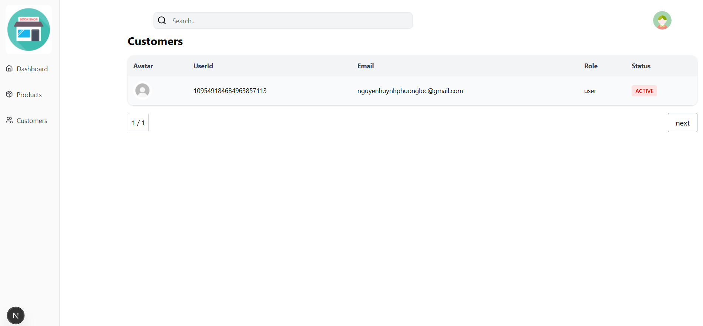

## Table of Contents
- # Overview
- # TechStack
- # Core Functions 
- # UI
- # Set up and install

----------------------------------------------------------------------------------------------------------------------------

# Overview

The Bookstore Website provides the following core functionalities: Product Catalog, Shopping Cart, Payment Processing, Comments, Notifications, and Access Control. 

Product Catalog: Customers can browse and purchase books using an effective search function. Each book includes essential details such as title, price, rating, and description, allowing customers to make informed purchase decisions. 

Shopping Cart: Customers can add products to their cart either from the product listing page or the detailed product page. The cart displays the number of items, the total price, and a summary of each product. Customers can easily remove items, and the system immediately updates the cart. Once ready, customers can proceed to checkout and pay for their selected products. 

Payment Processing: The bookstore integrates with external payment services such as Stripe. When a customer completes a payment, order details, revenue, and billing information are securely stored in Stripe instead of the company’s internal database. This enhances data privacy and security. 

Notification: When client complete successful payment process, system can inform some texts for client.

Comments: Customers can post comments on product detail pages. Additionally, they can like and reply to existing comments, creating an interactive and engaging community experience. 

Access Control: Both customers and administrators can login and register to the system. After logging in, customers are redirected to the homepage, while administrators gain access to the dedicated Admin Dashboard for managing products, orders, and system data. Moreover, buyer and admin can reset password through email if they forgot.

-----------------------------------------------------------------------------------------------------------------------------
# Tech Stack
Frontend: Nextjs(React), React Router, Axios, Tailwind/CSS
Backend: Node.js, Express.js, Nestjs
Database: MYSQL
Auth: JWT & bcrypt & OUTH2
Realtime: Socket.IO
Payments: Stripe
Notifications: Resend (Email)
Containerization: Docker Compose

--------------------------------------------------------------------------------------------------------------------------
+  GraphQL API
+  Apply to machine learning to analyze sentiment of buyers such as positive or negative classification
+  Caching,Database Optimization (Indexes, Relations with TypeORM/Postgres)
+  Payment Integration (Stripe)
+  Security (Rate limiting, Input validation, Password hashing)
+  Authentication & Authorization (Outh2,JWT, Role-based access: User/Admin)

---------------------------------------------------------------------------------------------------------------------------
 

---------------------------------------------------------------------------------------------------------------------------------------------------------------------------------------------------------

## UseCase

------------------------------------------------------------------------------------------------------------------------------------------------------------------------------------------------------------
##  Database Design (Mysql)

-------------------------------------------------------------------------------------------------------------------------------------------------------------------------------------------------------
## UI 

+ Login and Register Page with Outh2 and bazer accesstoken

+ HomePage

+ Product catalog

+ Detail Page

+ Review Book ( Apply to machine learning to analyze sentiment of buyers ) 

+ Cart

+Payment

+ Reset Passwrod
  

  

+ Admin

  

## Technology

# Backend

Framework: NestJS (Node.js framework mạnh mẽ, kiến trúc module hóa, dễ mở rộng).

Library: Express (NestJS mặc định chạy trên Express, có thể thay bằng Fastify).

Database: MySQL

# Frontend

Framework: Next.js (React framework, SSR/SSG).

Styling: TailwindCSS + shadcn/ui (UI components).

State Management: React Query

# Others

API Communication: GraphQL.

Deployment: Docker

# How to install and setup

Backend is building with NestJS, Express, Mysql. You need to open the folder "backend" and run 'npm install' to install all dependencies. After that run 'npm run dev'. Notely, you need to justify .env in project

Fronted is building with NextJS. You need to open the folder "fronted" and run 'npm install' to install all dependencies. After that run 'npm run dev'. Notely, you need to justify .env in project

